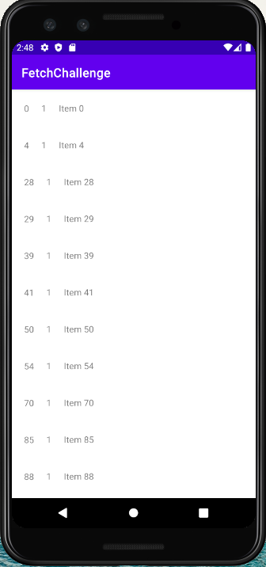

About this Project:

This project was created by Curt Kissel as part of the Fetch Rewards Coding Challenge. This Android mobile application was created to retrieve and display several "listings" from an API in an organized manner.

Implementation:

The UI for this application consists of a RecyclerView that contains a list of TextViews. RecyclerView is used because we are dealing with a large data set, and it is easy to recycle these views instead of allocating new views for each item in our data set.

To handle the api requests, the Retrofit library is used. Retrofit - alongside GSON - allows JSON data to be easily converted to Java objects.

To allow the retrieved data to be organized and stored, the Room library is used. Room allows data to be stored and accessed easily within the application. SQLite queries are supported which allows insertion, deletion, ordering, etc. to be performed on the data. This also allows the API responses to be cached.

Assumptions:

- When organizing the listings by name, we are ordering by number comparison, not string (alphabetical) comparison. Ex: "Item 20" should occur before "Item 100".
- Names of the listings will always be of the form "Item X" where x is the id of the listing.

Design:

This program was created using the Model View ViewModel Architecture. Although not as necessary for a project of this size, it allows the project to remain organized, scalable, and easily tested.

The ItemRepository class interacts with the data sources. In this case, the data sources are the API and the Room database. The MainViewModel class requests the data from the repository class. The UI (View) then displays the information within the MainViewModel class.

Libraries

- Retrofit(Gson) (https://square.github.io/retrofit/)
- Room (https://github.com/androidx-releases/Room/releases)